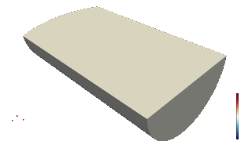

# Berstein Accelerated GPU Acoustic Solver

(Non)-Linear (lossy) wave equation solver on GPU based on dolfinx.

Spherical Transducer, Linear Wave Equation



## CSD3 [A100]

Obtain a GPU A100 node to build the spack environment using `salloc`

Install the spack environment in `hypre-cuda.yaml`
```
spack env create hypre-cuda hypre-cuda.yaml
spack env activate hypre-cuda
```

Once `spack install` has completed successfully, you can build the
examples in the `examples` folder using cmake. Here is a suitable setup
script
```
source spack/share/spack/setup-env.sh
spack env activate hypre-cuda
module use /usr/local/software/spack/spack-modules/a100-20221118/linux-rocky8-zen3
module load gcc/11.3.0/gcc/i4xnp7h5
module load openmpi/4.1.4/gcc/6kaxusn4
spack load cuda
spack load cmake
```

### Build an example
```
mkdir build
cd build
cmake -Dnvidia=on ..
make mat_free_mass
```


## LUMI [MI250X]

Install the spack environment in `hypre-rocm-lumi.yaml`
```
spack env create hypre-rocm hypre-rocm-lumi.yaml
spack env activate hypre-rocm
```

N.B. to install fenics-basix, you might need to patch spack slightly:
`spack edit fenics-basix` and add the following:
```
def cmake_args(self):
    options = ["-DBLAS_LIBRARIES=" + self.spec["blas"].libs.joined(),
          "-DLAPACK_LIBRARIES=" + self.spec["blas"].libs.joined()]
    return options
```

(`zfp` is also giving a problem - need to add `-lm` to `CMAKE_C_FLAGS`)

Once `spack install` has completed successfully, you can build the
examples in the `examples` folder using cmake.
```
# Setup required for "build" on login node
module load LUMI/23.09
module load partition/G
module load rocm
module load gcc
source spack/share/spack/setup-env.sh
spack env activate hypre-rocm
spack load cmake

# Build an example
mkdir build
cd build
cmake -Damd=ON ..
make mat_free_mass
```

Get a GPU node:

```
salloc --nodes=1 --ntasks-per-node=8 --gpus-per-node=8 --time=01:0:00 --partition=dev-g --account=ACCOUNT
export MPICH_GPU_SUPPORT_ENABLED=1
srun --ntasks=1 ./mat_free_mass --nelements 256
```

There are some instructions on running on GPU on the LUMI documentation,
especially about [selecting GPU/CPU
affinity](https://docs.lumi-supercomputer.eu/runjobs/scheduled-jobs/lumig-job/).


## Available executables

- **spherical_transducer_gpu**: Solve a linear wave equation on simplicial meshes on GPU  
- **mat_free_mass**: Apply the mass matrix operation; validate against CPU DOLFINx assembly  
- **mat_free_mass3D**: Apply the mass matrix operation in 3D; validate against CPU DOLFINx assembly  
- **mass_cg**: Apply the mass matrix operation within a Conjugate Gradient loop; compare against CPU DOLFINx assembly  
- **quad_gpu / hex_gpu**: Solve a linear wave equation on quadrilateral/hexahedral meshes on GPU (mass-lumped formulation)  
- **planar_wave_triangles**: Solve a planar wave equation on triangles; compare PETSc KSP CG and in-house CG solvers on CPU  
- **planar_wave_triangles_gpu**: Solve a planar wave equation on triangles on GPU using the Bernstein polynomial sum-factorisation algorithm  


